# 虚拟DOM之更新子节点（三）

## 回顾

之前我们了解了在`React`中是如何进行`Diff`的，并且也提到了该算法还是存在优化空间的，先来回顾一下：

需求如下：

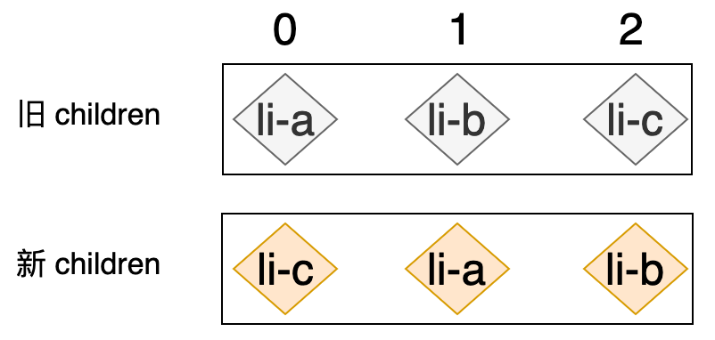

`React`中的`Difff`会这样操作：

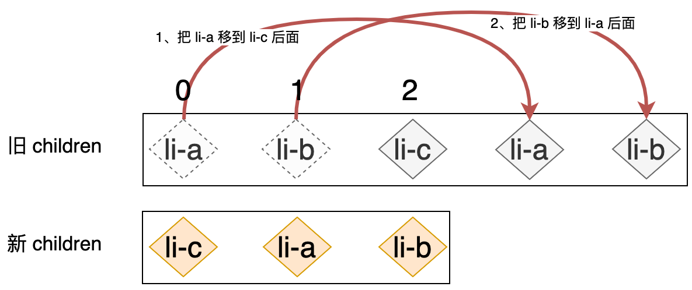

共移动了两次

1. 先将li-a移动至li-c后
2. 再将li-b移动至li-a后

然而，在这个例子中，我们可以通过肉眼观察从而得知最优的解决方案应该是：把 li-c 节点对应的真实 DOM 移动到最前面即可，只需要一次移动即可完成更新。

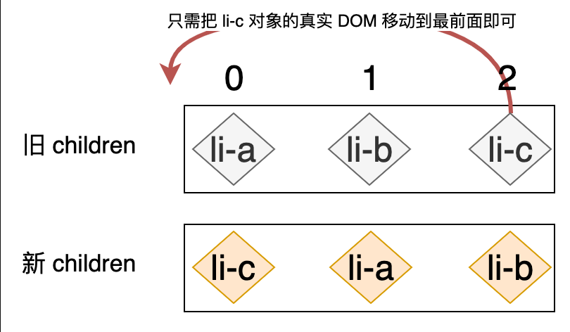

## 双端比较

所谓`双端比较`，就是同时从新旧子节点的两端开始比较的一种方式，所以我们需要四个索引值，分别指向新旧子节点的两端：

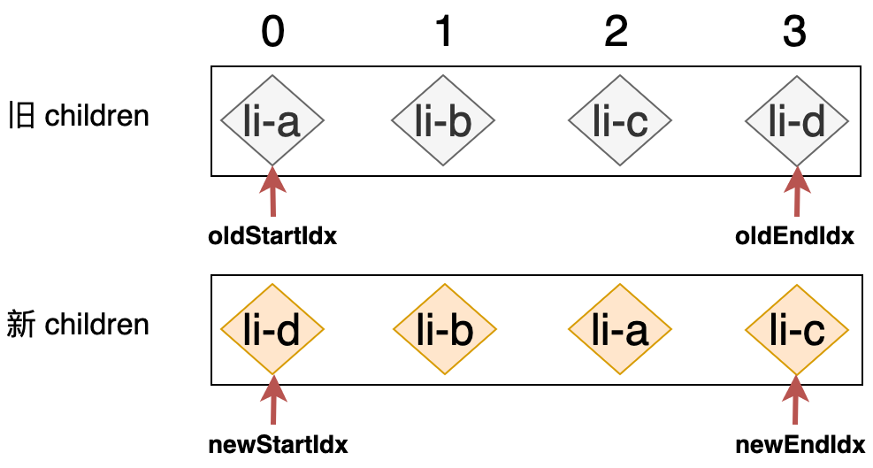

```js
// 获取四个索引
let oldStartIdx = 0;
let newStartIdx = 0;
let oldEndIdx = prevChildren.length - 1;
let newEndIdx = nextChildren.length - 1;

// 获取四个索引所指向的VNode
let oldStartVNode = prevChildren[oldStartIdx];
let newStartVNode = nextChildren[newStartIdx];
let oldEndVNode = prevChildren[oldEndIdx];
let newEndVNode = nextChildren[newEndIdx];
```

接下来进行双端比较：

在比较的过程中，必然需要使用循环，这里使用while循环：

```js
while(oldStartIdx <= oldEndIdx && newStartIdx <= newEndIdx){
    //...双端比较
}
```

双端比较，分为四个步骤：

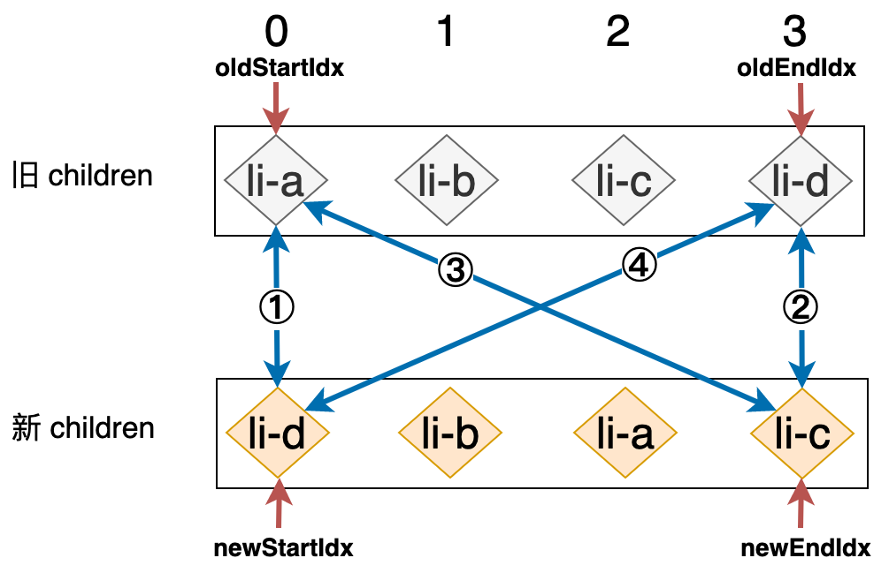

1. 旧前 VS 新前
2. 旧后 VS 新后
3. 旧前 VS 新后
4. 旧后 VS 新前

```js
// 旧前 VS 新前
if (oldStartVNode.key === newStartVNode.key) {
    //...
}
// 旧后 VS 新后
else if (oldEndVNode.key === newEndVNode.key) {
    //...
}
// 旧前 VS 新后
else if (oldStartVNode.key === newEndVNode.key) {
    //...
}
// 旧后 VS 新前
else if (oldEndVNode.key === newStartVNode.key) {
    //...
}
```

以之前的例子作为基础，看看双端比较是如何操作的：


1. 旧前 VS 新前 --> key不同 --> 什么也不做
2. 旧后 VS 新后 --> key不同 --> 什么也不做
3. 旧前 VS 新后 --> key不同 --> 什么也不做
4. 旧后 VS 新前 --> key相同 --> 找到了可复用的节点

在第四步找到了可复用的节点，说明：

li-d节点所对应的真实DOM原本是最后一个子节点，并且更新之后它应该变成第一个子节点。所以我们需要把li-d所对应的真实DOM移动到最前方即可

```js
// 旧前 VS 新前
if (oldStartVNode.key === newStartVNode.key) {
    //...
}
// 旧后 VS 新后
else if (oldEndVNode.key === newEndVNode.key) {
    //...
}
// 旧前 VS 新后
else if (oldStartVNode.key === newEndVNode.key) {
    //...
}
// 旧后 VS 新前
else if (oldEndVNode.key === newStartVNode.key) {
    //先更新
    patch(oldEndVNode, newStartVNode, container)
    //移动
    insertBefore(container,oldEndVNode.el,oldStartVNode.el);
    //更新索引
    oldEndIdx = oldEndIdx - 1;
    newStartIdx = newStartIdx + 1;
    newStartVNode = prevChildren[newStartIdx];
    oldEndVNode = nextChildren[oldEndIdx];
}
```

更新并移动后,新的索引关系：

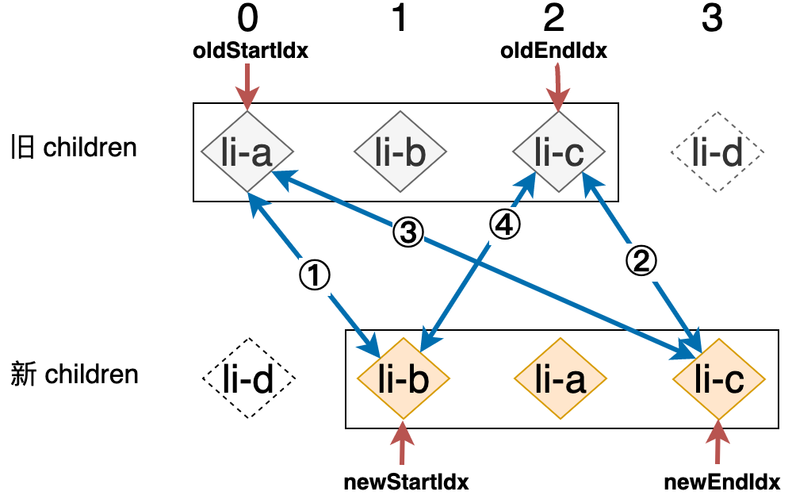

接着第二轮对比：

1. 旧前 VS 新前 --> key不同 --> 什么也不做
2. 旧后 VS 新后 --> key相同 --> 找到可复用节点

由于找到的可复用节点，均为最末节点，所以不需要移动，只需更新即可

```js
// 旧前 VS 新前
if (oldStartVNode.key === newStartVNode.key) {
    //...
}
// 旧后 VS 新后
else if (oldEndVNode.key === newEndVNode.key) {
    patch(oldEndVNode, newEndVNode, container)
    oldEndIdx = oldEndIdx - 1;
    newEndIdx = newEndIdx - 1;
    oldEndVNode = prevChildren[oldEndIdx];
    oldNewVNode = nextChildren[oldNewIdx];
}
// 旧前 VS 新后
else if (oldStartVNode.key === newEndVNode.key) {
    //...
}
// 旧后 VS 新前
else if (oldEndVNode.key === newStartVNode.key) {
    //...
}
```

更新后，新的索引关系：


继续比较:

1. 旧前 VS 新前 --> key不同 --> 什么也不做
2. 旧后 VS 新后 --> key不同 --> 什么也不做
3. 旧前 VS 新后 --> key相同 --> 找到可复用节点

此时li-a节点所对应的真实Dom原本是第一个子节点，但现在变成了最后一个节点（这里的最后指的是索引范围内的最后一个节点），所以需要移动：

```js
// 旧前 VS 新前
if (oldStartVNode.key === newStartVNode.key) {
    //...
}
// 旧后 VS 新后
else if (oldEndVNode.key === newEndVNode.key) {
    //...
}
// 旧前 VS 新后
else if (oldStartVNode.key === newEndVNode.key) {
    patch(oldStartVNode, newEndVNode, container);
    insertBefore(container,oldStartVNode.el,getNextSibling(oldEndVNode.el))
    oldStartIdx = oldStartIdx + 1;
    newEndIdx = newEndIdx - 1;
    oldStartVNode = prevChildren[oldStartIdx];
    newEndVNode = nextChildren[newEndIdx];
}
// 旧后 VS 新前
else if (oldEndVNode.key === newStartVNode.key) {
    //...
}
```

更新并移动后，新的索引关系：

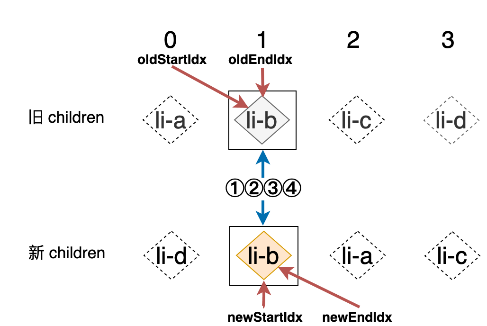

继续比较:

1. 旧前 VS 新前 --> key相同 --> 找到可复用的节点

由于找到的可复用的节点均是索引序列中的开始节点，所以不需要移动，只需更新即可：

```js
// 旧前 VS 新前
if (oldStartVNode.key === newStartVNode.key) {
    patch(oldStartVNode, newStartVNode, container)
    oldStartIdx = oldStartIdx + 1;
    newStartIdx = newStartIdx + 1;
    oldStartVNode = prevChildren[oldStartIdx]
    newStartVNode = nextChildren[newStartIdx]
}
// 旧后 VS 新后
else if (oldEndVNode.key === newEndVNode.key) {
    //...
}
// 旧前 VS 新后
else if (oldStartVNode.key === newEndVNode.key) {
    //...
}
// 旧后 VS 新前
else if (oldEndVNode.key === newStartVNode.key) {
    //...
}
```

在这一轮更新完成之后，虽然没有进行任何移动操作，但是我们发现，真实DOM的顺序，已经与新子节点的顺序保持一致了，也就是说我们圆满的完成了目标，如下图所示：

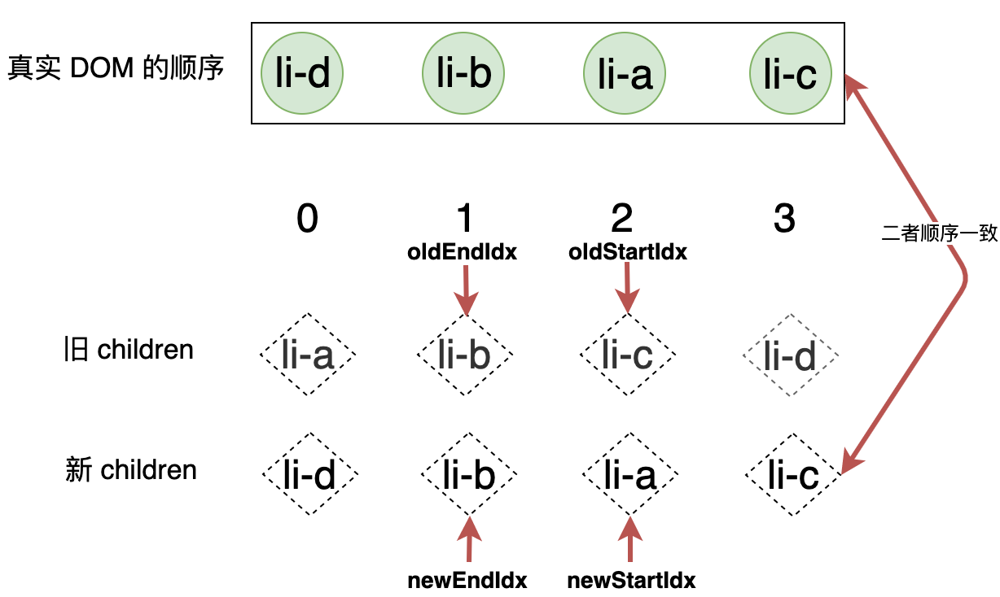

## 非理想情况

之前的双端比较，分为四步：

1. 旧前 VS 新前
2. 旧后 VS 新后
3. 旧前 VS 新后
4. 旧后 VS 新前

之前的例子，是比较理想化的例子，在每轮比较中，总会满足四个步骤中的一步，但实际情况下并不会这么理想：


上图中 ①、②、③、④ 这四步中的每一步比对，都无法找到可复用的节点，此时我们只能通过循环的方式，来试图寻找新前节点在旧节点中的索引值`idxInOld`

```js
while(oldStartIdx <= oldEndIdx && newStartIdx <= newEndIdx){
    //旧前-新前
    if(oldStartVNode.key === newStartVNode.key){
        //...
    }
    //旧后-新后-无需移动
    else if(oldEndVNode.key === newEndVNode.key){
        //...
    }
    //旧前-新后
    else if(oldStartVNode.key === newEndVNode.key){
        //...
    }
    //旧后-新前-需要移动
    else if(oldEndVNode.key === newStartVNode.key){
        //...
    }
    //双端比较均没有找到
    else{
        //新前节点在 oldChildren 中的位置
        const idxInOld = prevChildren.findIndex(node=>node.key === newStartVNode.key);
        //找到
        if(idxInOld >= 0){

        }
        //没找到
        else{

        }
    }
}
```

如果`idxInOld`被找到，则意味着这个索引对应的旧节点的真实DOM，在新节点中的顺序，已经变成了第一个节点：

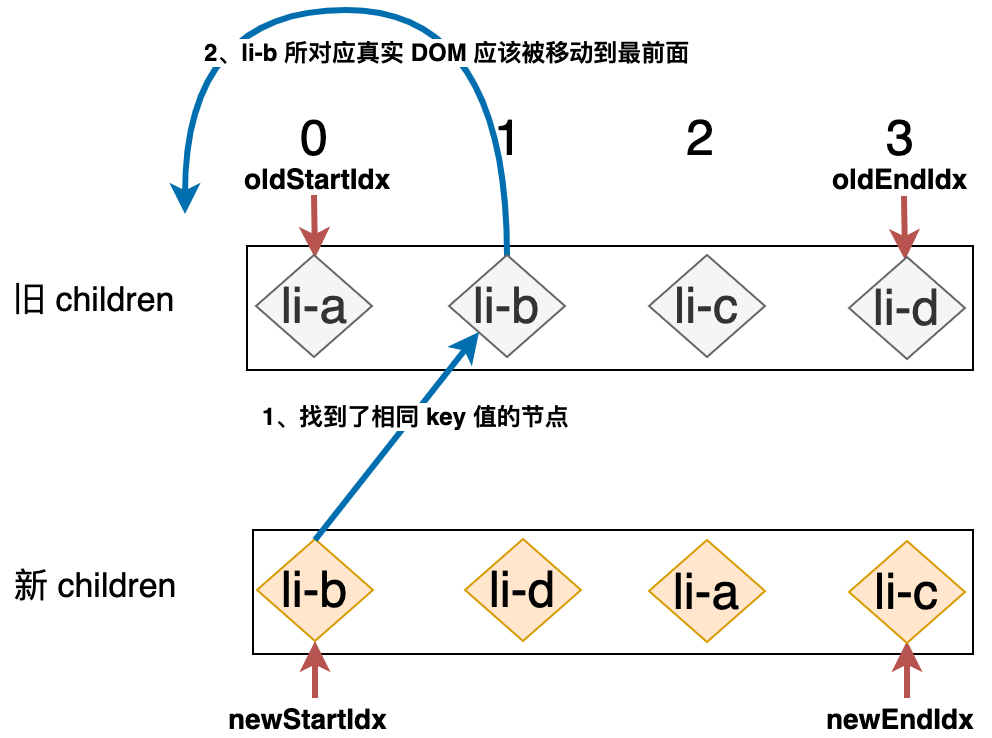

代码如下：

```js
//新前节点在 oldChildren 中的位置
const idxInOld = prevChildren.findIndex(node=>node && node.key === newStartVNode.key);
//找到
if(idxInOld >= 0){
    //需要移动的旧节点
    const vNodeToMove = prevChildren[idxInOld];
    //先更新
    patch(vNodeToMove,newStartVNode,container);
    //移动DOM
    insertBefore(container,vNodeToMove.el,oldStartVNode.el)
    //已移动的 VNode 设置为 undefined
    prevChildren[idxInOld] = undefined;

    newStartIdx = newStartIdx + 1
    newStartVNode = nextChildren[newStartIdx]
}
//没找到
else{
    //...
}
```

需要注意的是，由于我们找到的旧节点的DOM已经被移动，所以我们将该节点设置为`undefined`,并且将`newStartIdx`下移一位：

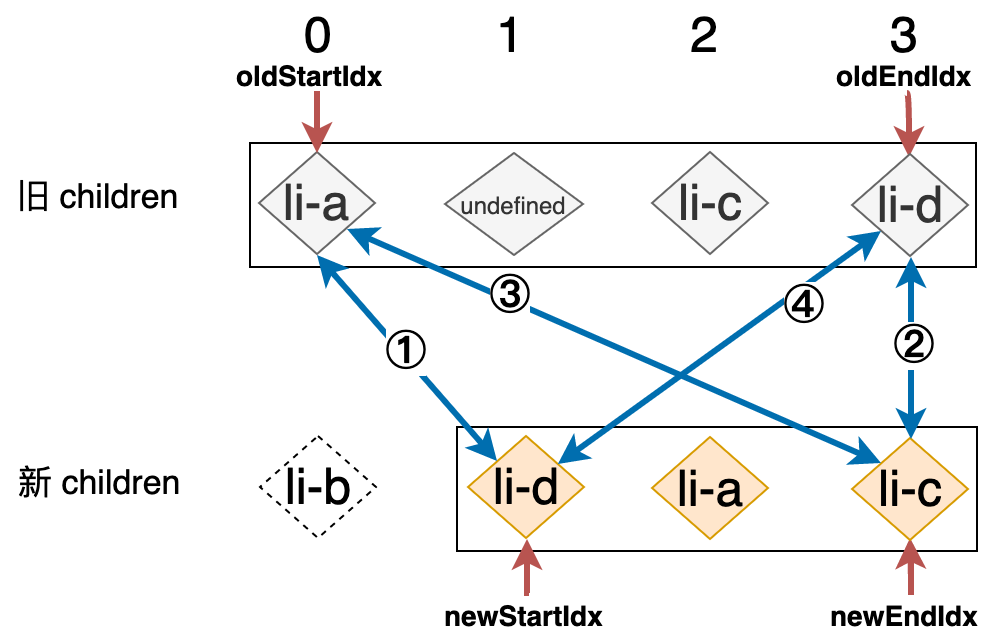

由于旧节点中出现了undefined，所以在接下来的比较的过程中，`oldStartVNode`或`oldEndVNode`两者之一可能是`undefined`，此时说明该节点已经被处理了，可以跳过这一位置：

```js
while(oldStartIdx <= oldEndIdx && newStartIdx <= newEndIdx){
    if(!oldStartVNode){
        oldStartIdx = oldStartIdx + 1;
        oldStartVNode = prevChildren[oldStartIdx];
    }
    else if(!oldEndVNode){
        oldEndIdx = oldEndIdx - 1;
        oldEndVNode = prevChildren[oldEndIdx];
    }
    //旧前-新前
    else if(oldStartVNode.key === newStartVNode.key){
        //...
    }
    //旧后-新后-无需移动
    else if(oldEndVNode.key === newEndVNode.key){
        //...
    }
    //旧前-新后
    else if(oldStartVNode.key === newEndVNode.key){
        //...
    }
    //旧后-新前-需要移动
    else if(oldEndVNode.key === newStartVNode.key){
        //...
    }
    //双端比较均没有找到
    else{
        //...
    }
}
```

## 添加新元素

商界前文，当双端比较没有找到复用节点时，会遍历旧节点寻找与新前节点key相同的旧节点索引`idxInOld`,当`idxInOld`没有被找到时，则可以认为这个新前节点就是新增的节点：

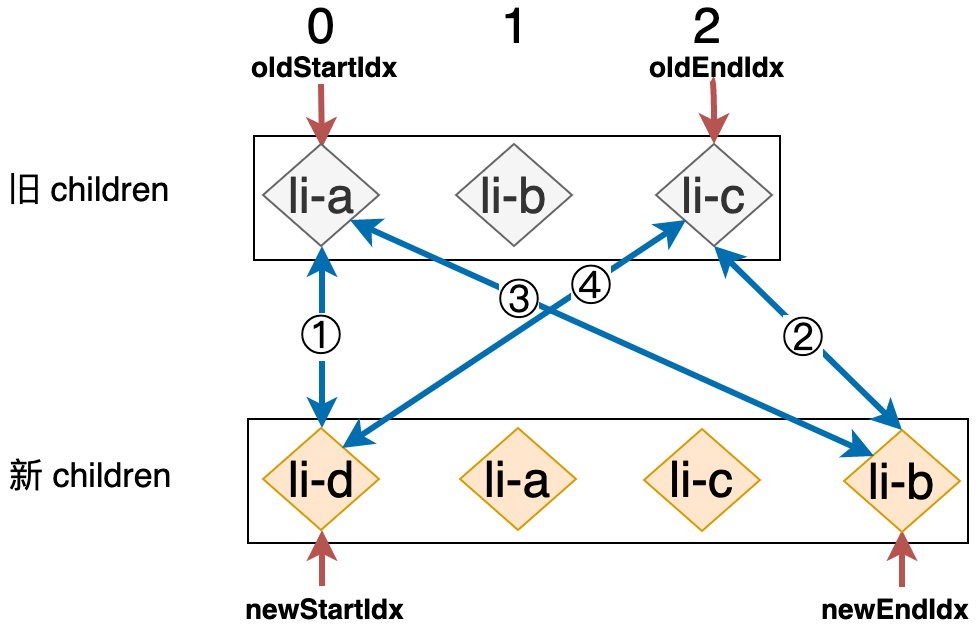

代码如下：


```js
//新前节点在 oldChildren 中的位置
const idxInOld = prevChildren.findIndex(node=>node && node.key === newStartVNode.key);
//找到
if(idxInOld >= 0){
    //需要移动的旧节点
    const vNodeToMove = prevChildren[idxInOld];
    //先更新
    patch(vNodeToMove,newStartVNode,container);
    //移动DOM
    insertBefore(container,vNodeToMove.el,oldStartVNode.el)
    //已移动的 VNode 设置为 undefined
    prevChildren[idxInOld] = undefined;

    newStartIdx = newStartIdx + 1
    newStartVNode = nextChildren[newStartIdx]
}
//没找到
else{
    //...
}
```

需要注意的是，由于我们找到的旧节点的DOM已经被移动，所以我们将该节点设置为`undefined`,并且将`newStartIdx`下移一位：


由于旧节点中出现了undefined，所以在接下来的比较的过程中，`oldStartVNode`或`oldEndVNode`两者之一可能是`undefined`，此时说明该节点已经被处理了，可以跳过这一位置：

```js
while(oldStartIdx <= oldEndIdx && newStartIdx <= newEndIdx){
    if(!oldStartVNode){
        oldStartIdx = oldStartIdx + 1;
        oldStartVNode = prevChildren[oldStartIdx];
    }
    else if(!oldEndVNode){
        oldEndIdx = oldEndIdx - 1;
        oldEndVNode = prevChildren[oldEndIdx];
    }
    //旧前-新前
    else if(oldStartVNode.key === newStartVNode.key){
        //...
    }
    //旧后-新后-无需移动
    else if(oldEndVNode.key === newEndVNode.key){
        //...
    }
    //旧前-新后
    else if(oldStartVNode.key === newEndVNode.key){
        //...
    }
    //旧后-新前-需要移动
    else if(oldEndVNode.key === newStartVNode.key){
        //...
    }
    //双端比较均没有找到
    else{
        const idxInOld = prevChildren.findIndex(node=>node && node.key === newStartVNode.key);
        //找到
        if(idxInOld >= 0){
            //...
        }
        //没找到
        else{
            mount(newStartVNode,container,oldStartVNode.el)
            newStartIdx = newStartIdx + 1;
            newStartVNode = nextChildren[newStartIdx]
        }
    }
}
```

再看另一种情况：

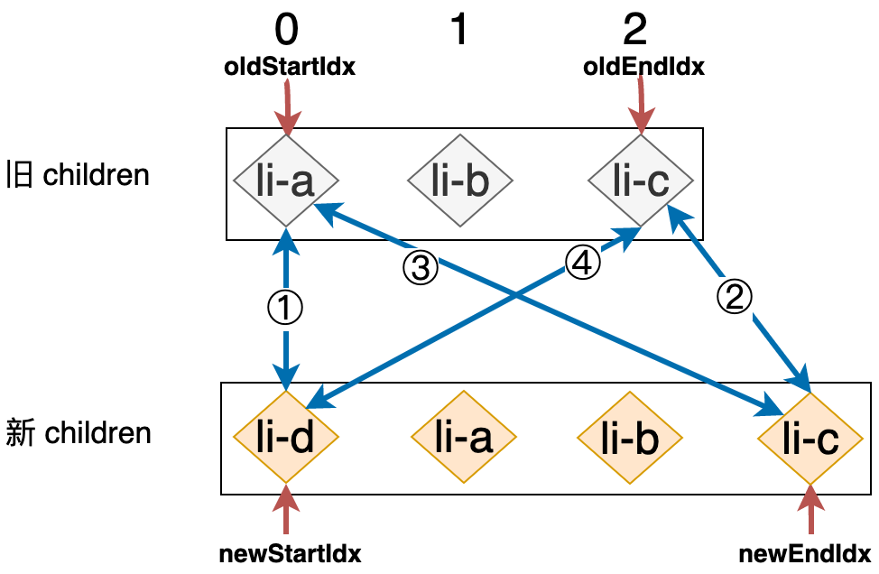

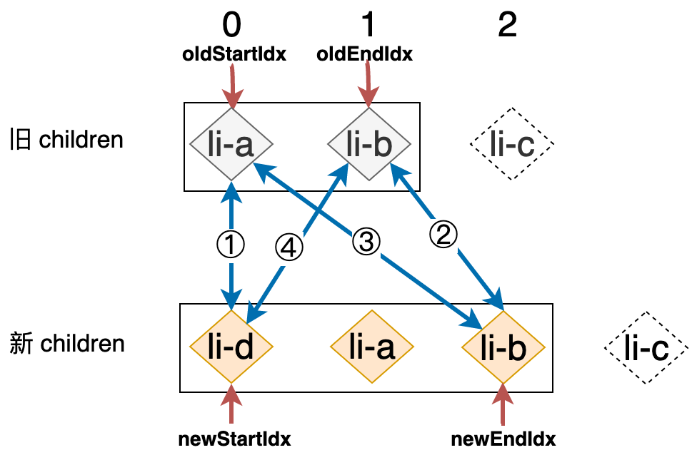

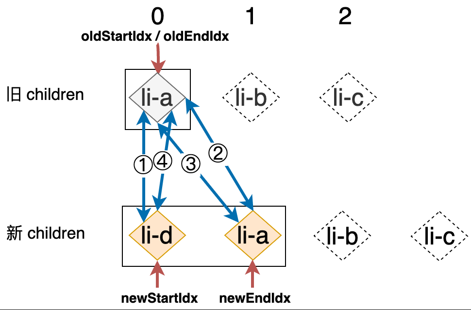

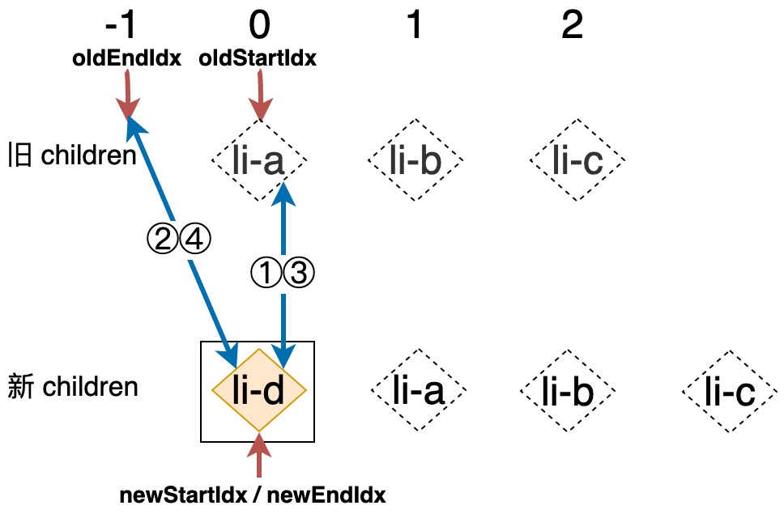

我们发现，经过双端比较后，旧节点的索引已经循环完成，此时循环的条件已经不再满足，但新节点中，依然有遗漏的节点，遗漏的节点即为新增的节点：

```js
while (oldStartIdx <= oldEndIdx && newStartIdx <= newEndIdx) {
  // 省略...
}
if (oldEndIdx < oldStartIdx) {
  // 添加新节点
  for (let i = newStartIdx; i <= newEndIdx; i++) {
    mount(nextChildren[i], container, oldStartVNode.el)
  }
}
```

## 删除元素

对于双端比较，最后一个需要考虑的情况是：当有元素被移除时的情况，如下图所示：

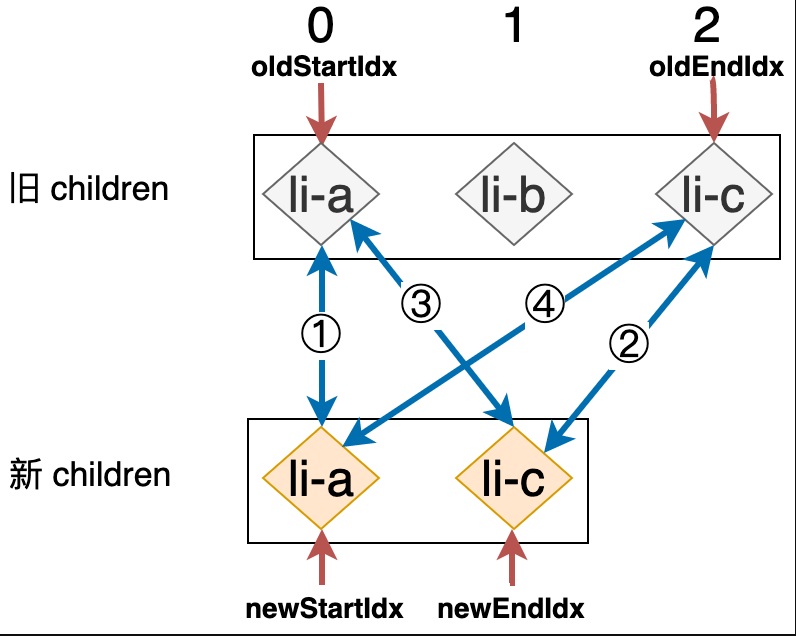

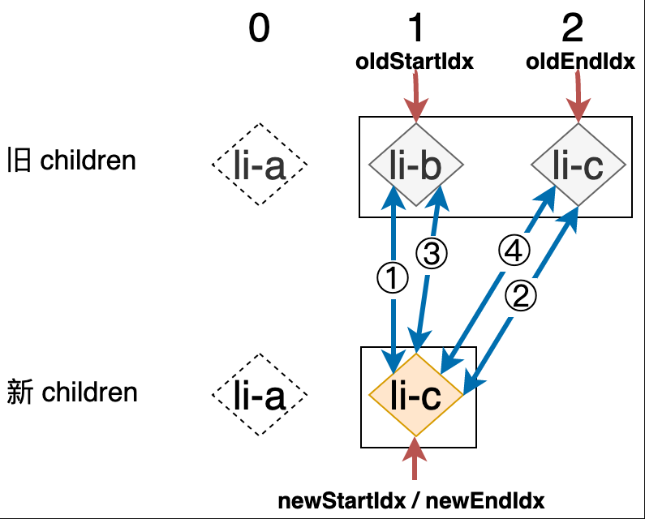

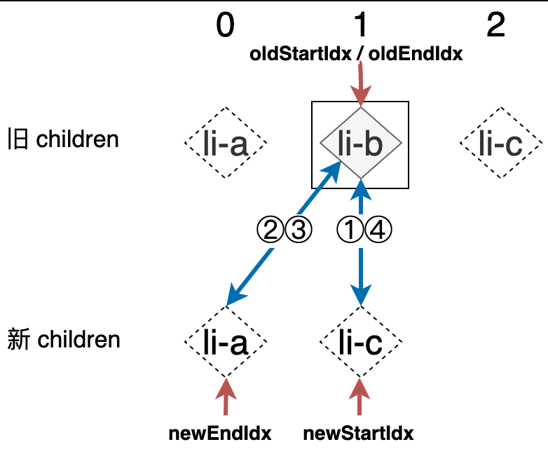

我们发现，经过双端比较后，新节点的索引已经循环完成，此时循环的条件已经不再满足，但旧节点中，依然有未处理的节点，这些节点即为需要删除的节点：

```js
while (oldStartIdx <= oldEndIdx && newStartIdx <= newEndIdx) {
  // 省略...
}
if (oldEndIdx < oldStartIdx) {
  // 添加新节点
  for (let i = newStartIdx; i <= newEndIdx; i++) {
    mount(nextChildren[i], container, false, oldStartVNode.el)
  }
} else if (newEndIdx < newStartIdx) {
  // 移除操作
  for (let i = oldStartIdx; i <= oldEndIdx; i++) {
    container.removeChild(prevChildren[i].el)
  }
}
```

::: tip
完整代码&在线体验地址：https://codesandbox.io/s/zen-moore-dr6wd
:::