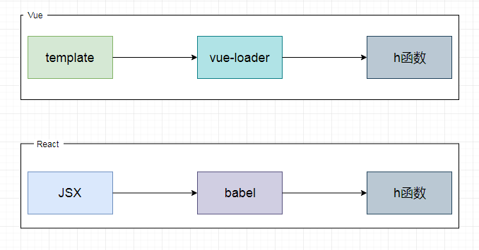
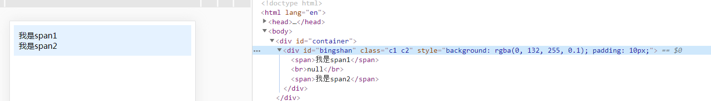

# 虚拟DOM之更新

## 回顾

### 什么是虚拟DOM

虚拟DOM简而言之就是，用JS去按照DOM结构来实现的树形结构对象，一般称之为虚拟节点(VNode)

> 例1

```html
<div class="container" style="color:red">
<div>
```

```javascript
let VNode = {
    tag: 'div',
    data:{
        class:'container',
        style:{
            color:'red'
        }
    },
    children:[]
}
```

> 例2

```html
我是文本
```

```javascript
let VNode = {
    tag:null,
    children:'我是文本'
}
```

> 例3

```html
<div class="container">
    <!-- 子元素1 -->
    <!-- 子元素2 -->
<div>
```

```javascript
let VNode = {
    tag: 'div',
    data:{
        class:'container'
    },
    children:[
        VNode1, // 对应子元素1
        VNode2  // 对应子元素2
    ]
}
```

> 完整的例子：

```html
<div class="container">
    <h1 style="color:red">标题</h1>
    <span style="color:grey">内容</span>
<div>
```

对应的VNode结构如下：

```javascript
let VNode = {
    tag: 'div',
    data:{
        class:'container'
    },
    children:[
        {
            tag:'h1',
            data：null,
            children:{
                data: {
                    style:{
                        color:'red'
                    }
                },
                children: '标题'
            }
        },
        {
            tag:'span',
            data:null,
            children:{
                data: {
                    style:{
                        color:'grey'
                    }
                },
                children: '内容'
            }
        },
    ]
}
```

### 什么是h函数

h函数作为创建VNode对象的函数封装，React中通过babel将JSX转换为h函数的形式，Vue中通过vue-loader将模板转换为h函数。



```javascript
function h(tag = null,data = null,children = null){
    // ...
}
```

假如在Vue中我们有如下模板：

```html
<template>
  <div>
    <h1></h1>
  </div>
</template>
```

用 h 函数来创建与之相符的 VNode：

```javascript
const VNode = h('div', null, h('span'))
```

得到的 VNode 对象如下：

```javascript
const VNode = {
  tag: 'div',
  data: null,
  children: {
    tag: 'span',
    data: null,
    children: null
  }
}
```

### 什么是虚拟DOM的挂载

虚拟DOM的挂载就是将虚拟DOM转化为真实DOM的过程

主要用到如下原生属性或原生方法：

+ 创建标签：document.createElement(tag)
+ 创建文本：document.createTextNode(text);
+ 追加节点：parentElement.appendChild(element)

### render函数是做什么的

render函数的作用就是：将VNode转化为真实DOM

接收两个参数:

+ 虚拟节点
+ 挂载的容器

```javascript
function render(VNode,container){
    //...
}
```

### 演示

通过 h函数 和 render函数，生成如下结构的html

容器：

```html
<div id="container"></div>
```

像容器中插入如下html片段：

```html
<div id="bingshan" class="c1 c2" style="background: rgba(0, 132, 255, 0.1); padding: 10px;">
    <span>我是span1</span>
    <br>
    <span>我是span2</span>
</div>
```

代码如下：

```javascript
let container = document.getElementById('container');

let VNode = h('div',
    {
        style: {
            background: '#0084ff1a',
            padding:'10px'
        },
        id:'bingshan',
        class:['c1 c2'],
        onclick:function(){
            alert('VNode')
        }
    }, 
    [
        h('span',null,'我是span1'),
        h('br'),
        h('span',null,'我是span2')
    ]
)

// 挂载
render(VNode, container)
```

结果如下：



## 什么是虚拟DOM的更新

虚拟DOM的更新指的是：当节点对应的VNode发生变更时，比较新旧VNode的异同，更新真实DOM节点

虚拟DOM更新时依然会调用Render函数

本文暂不涉及Vue和React中当数据变化时是如何重新生成VNode以及如何调用Render函数的，在此通过手动调用的方式来模拟：

```javascript
let prevVNode = {
    //...
}
let nextVNode = {
    //...
}

//挂载
render(prevVNode,container)

//更新
setTimeout(function(){
    render(nextVNode,container)
},2000)
```

## render

由于更新时需要获取prevVNode与nextVNode进行比较，所以在挂载时，将prevVNode存储在容器节点的属性上，方便更新时使用。

```javascript
function render(VNode,container){
    //初始化渲染
    mount(vNode,container);
    container.vNode = vNode;
}
```

既然容器节点的属性存储了prevVNode，那么我们就可以在调用render函数时，通过判断是否有vNode这个属性，来判断是挂载还是更新。

```javascript
function render(vNode,container){
    const prevVNode = container.vNode;
    //之前没有-挂载
    if(prevVNode === null || prevVNode === undefined){
        if(vNode){
            mount(vNode,container);
            container.vNode = vNode;
        }
    }
    //之前有-更新
    else{
        //....
    }
}
```

我们在更新的时候，又分为两种情况：

1. prevVNode和nextVNode都有，执行比较操作
2. 有prevVNode没有nextVNode，删除prevVNode对应的DOM即可

```javascript
function render(vNode,container){
    const prevVNode = container.vNode;
    //之前没有-挂载
    if(prevVNode === null || prevVNode === undefined){
        if(vNode){
            mount(vNode,container);
            container.vNode = vNode;
        }
    }
    //之前有-更新
    else{
        //之前有，现在也有
        if(vNode){
            //比较
        }
        //以前有,现在没有,删除
        else{
            //删除原有节点
        }
    }
}
```

我们先考虑有prevVNode没有nextVNode的情况，此时需要删除prevVNode对应的DOM节点

那么如何获取prevVNode对应的DOM节点呢？

我们可以在挂载的阶段，将dom节点作为属性存储在prevVNode上：

```javascript
function mountElement(VNode, container) {
    //省略...
    const el = createElement(tag);
    VNode.el = el;
    //省略...
}

function mountText = (VNode, container) {
    const el = createTextNode(VNode.children);
    vNode.el = el;
    appendChild(container, el);
}
```

再考虑有prevVNode也有nextVNode的情况，此时需要对二者进行对比，考虑实现patch函数

```javascript
function patch(prevVNode,nextVNode,container){
    //...
}
```

最终render函数的代码如下：

```javascript
function render(vNode,container){
    const prevVNode = container.vNode;
    //之前没有-挂载
    if(prevVNode === null || prevVNode === undefined){
        if(vNode){
            mount(vNode,container);
            container.vNode = vNode;
        }
    }
    //之前有-更新
    else{
        //之前有，现在也有
        if(vNode){
            patch(prevVNode,vNode,container);
            container.vNode = vNode;
        }
        //以前有,现在没有,删除
        else{
            removeChild(container,prevVNode.el);
            container.vNode = null;
        }
    }
}
```

## patch

现在我们来考虑，prevVNode 和 nextVNode 是如何进行对比的。

我们现在将VNode只分为了两类：

1. 元素节点
2. 文本节点

那么 prevVNode 和 nextVNode 可能出现的情况只会有以下三种：

1. 二者类型不同
2. 二者都是文本节点
3. 二者都是元素节点，且标签相同

当二者类型不同时，只需删除原节点，挂载新节点即可：

```javascript
function patch (prevVNode, nextVNode, container) {
    removeChild(container, prevVNode.el);
    mount(nextVNode, container);
}
```

当二者都是文本节点时，只需修改文本即可

```javascript
function patch (prevVNode, nextVNode, container) {
    const el = (nextVNode.el = prevVNode.el)
    if(nextVNode.children !== prevVNode.children){
        el.nodeValue = nextVNode.children;
    }
}
```

当二者都是元素节点且标签相同时，此时比较麻烦，考虑是一个patchElement函数用于处理此种情况

```javascript
function patch (prevVNode, nextVNode, container) {
    patchElement(prevVNode, nextVNode, container)
}
```

最终 patch 函数的代码如下：

```javascript
function patch (prevVNode, nextVNode, container) {
    // 类型不同,直接替换
    if ((prevVNode.tag || nextVNode.tag) && prevVNode.tag !== nextVNode.tag) {
        removeChild(container, prevVNode.el);
        mount(nextVNode, container);
    }
    // 都是文本
    else if(!prevVNode.tag && !nextVNode.tag){
        const el = (nextVNode.el = prevVNode.el)
        if(nextVNode.children !== prevVNode.children){
            el.nodeValue = nextVNode.children;
        }
    }
    // 都是相同类型的元素
    else {
        patchElement(prevVNode, nextVNode, container)
    }
}
```

## 比较相同tag的VNode(patchElement)

因为tag相同，所以patchElement函数的功能主要有两个：

1. 检查prevVNode和nextVNode对应的元素属性是否一致(style、class、event等)，不一致更新
2. 比较prevVNode和nextVNode对应的子节点(children)

关于元素属性的比较与挂载阶段的逻辑基本一致，就不在此继续展开，我们主要考虑如何对子节点进行比较

子节点可能出现的情况有三种：

1. 没有子节点
2. 一个子节点
3. 多个子节点

所以关于prevVNode和nextVNode子节点的比较，共有9种情况：

1. 旧:单个子节点 && 新：单个子节点
2. 旧:单个子节点 && 新：没有子节点
3. 旧:单个子节点 && 新：多个子节点
4. 旧:没有子节点 && 新：单个子节点
5. 旧:没有子节点 && 新：没有子节点
6. 旧:没有子节点 && 新：多个子节点
7. 旧:多个子节点 && 新：单个子节点
8. 旧:多个子节点 && 新：没有子节点
9. 旧:多个子节点 && 新：多个子节点

前8中情况都比较简单，这里简单概括一下：

### 1.旧:单个子节点 && 新：单个子节点

都为单个子节点，递归调用patch函数

### 2.旧:单个子节点 && 新：没有子节点

删除旧子节点对应的DOM

### 3.旧:单个子节点 && 新：多个子节点

删除旧子节点对应的DOM，并将多个新子节点依次递归调用mount函数进行挂载即可

### 4.旧:没有子节点 && 新：单个子节点

直接调用mount函数疆新单个子节点进行挂载即可

### 5.旧:没有子节点 && 新：没有子节点

什么也不做

### 6.旧:没有子节点 && 新：多个子节点

将多个新子节点依次递归调用mount函数进行挂载即可

### 7.旧:多个子节点 && 新：单个子节点

删除多个旧子节点对应的DOM，递归调用mount函数对单个新子节点进行挂载即可

### 8.旧:多个子节点 && 新：没有子节点

删除多个旧子节点对应的DOM即可

### 9.旧:多个子节点 && 新：多个子节点

对于新旧子节点均为多个子节点的情况，是VNode更新阶段最复杂的情况，无论是React还是Vue都有不同的实现方案，这些实现方案也就是我们常说的Diff算法。

今天先不涉及比较复杂的Diff算法，关于Diff算法的内容，留到日后进行讲解，我们先通过最简单的方式来实现多个新旧子节点的更新（性能最差的做法）。

遍历旧的子节点，将其全部移除:

```javascript
for (let i = 0; i < prevChildren.length; i++) {
    removeChild(container,prevChildren[i].el)
}
```

遍历新的子节点，将其全部挂载

```javascript
for (let i = 0; i < nextChildren.length; i++) {
    mount(nextChildren[i], container)
}
```

最终的代码如下：

```javascript

export const patchElement = function (prevVNode, nextVNode, container) {

    const el = (nextVNode.el = prevVNode.el);

    const prevData = prevVNode.data;
    const nextData = nextVNode.data;

    if (nextData) {
        for (let key in nextData) {
            let prevValue = prevData[key];
            let nextValue = nextData[key];
            patchData(el, key, prevValue, nextValue);
        }
    }
    if (prevData) {
        for (let key in prevData) {
            let prevValue = prevData[key];
            if (prevValue && !nextData.hasOwnProperty(key)) {
                patchData(el, key, prevValue, null);
            }
        }
    }
    //比较子节点
    patchChildren(
        prevVNode.children,
        nextVNode.children,
        el
    )
}


function patchChildren(prevChildren, nextChildren, container) {
    //旧:单个子节点
    if(prevChildren && !Array.isArray(prevChildren)){
        //新：单个子节点
        if(nextChildren && !Array.isArray(nextChildren)){
            patch(prevChildren,nextChildren,container)
        }
        //新：没有子节点
        else if(!nextChildren){
            removeChild(container,prevChildren.el)
        }
        //新：多个子节点
        else{
            removeChild(container,prevChildren.el)
            for(let i = 0; i<nextChildren.length; i++){
                mount(nextChildren[i], container)
            }
        }
    }
    //旧:没有子节点
    else if(!prevChildren){
        //新：单个子节点
        if(nextChildren && !Array.isArray(nextChildren)){
            mount(nextChildren, container) 
        }
        //新：没有子节点
        else if(!nextChildren){
            //什么都不做
        }
        //新：多个子节点
        else{
            for (let i = 0; i < nextChildren.length; i++) {
                mount(nextChildren[i], container)
            }
        }
    }
    //旧:多个子节点
    else {
        //新：单个子节点
        if(nextChildren && !Array.isArray(nextChildren)){
            for(let i = 0; i<prevChildren.length; i++){
                removeChild(container,prevChildren[i].el)
            }
            mount(nextChildren,container)   
        }
        //新：没有子节点
        else if(!nextChildren){
            for(let i = 0; i<prevChildren.length; i++){
                removeChild(container,prevChildren[i].el)
            }
        }
        //新：多个子节点
        else{
            // 遍历旧的子节点，将其全部移除
            for (let i = 0; i < prevChildren.length; i++) {
                removeChild(container,prevChildren[i].el)
            }
            // 遍历新的子节点，将其全部添加
            for (let i = 0; i < nextChildren.length; i++) {
                mount(nextChildren[i], container)
            }
        }
    }

}
```